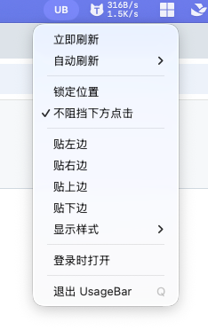
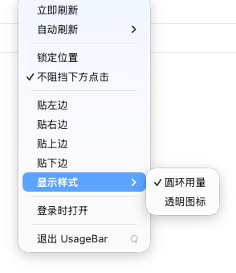

# UsageBar

[English](README.md) · [中文](README_CN.md)

A tiny edge bar that shows AI plan usage for **Codex**, **Cursor**, **Grok**, and **GLM**. It reads local login state only, talks to each official API, and never sends your chats through a third-party server.

macOS 12+ · Windows · Linux · MIT License · [Download latest](https://github.com/rayelzz/UsageBar-tauri/releases/latest)

### Contents

- [Features](#features)
- [How usage and reset time are read](#how-usage-and-reset-time-are-read)
- [Install](#install)
- [Menu](#menu)
- [FAQ](#faq)
- [Privacy](#privacy)
- [License](#license)

| Codex | Cursor |
| --- | --- |
|  |  |

| Grok | GLM |
| --- | --- |
|  |  |

<p>
  
  &nbsp;
  
  &nbsp;
  
</p>

### Features

- Four rings on one compact bar: Codex, Cursor, Grok, GLM
- Hover for included usage, API usage, weekly / 5-hour windows, and reset time
- Drag anywhere; snap to left / right / top / bottom
- Two display styles: **Ring usage** (full rings + percent) or **Transparent icons** (mini rings, still docked to an edge)
- On top / bottom edges, the percent sits to the right of each ring
- Click-through when the mouse is not on the bar
- Status / tray item is the text **UB** (macOS). Right-click the bar or click **UB** for the same menu
- Auto-refresh every 60 seconds (configurable)
- Official brand icons; red when remaining &lt; 20% (used ≥ 80%), yellow when remaining 20%–40% (used 60%–80%), green otherwise

### How usage and reset time are read

UsageBar does **not** estimate anything. It reuses credentials already on this computer and calls each vendor’s official usage endpoint.

| Tool | Local credential | Official API | Ring / tooltip |
| --- | --- | --- | --- |
| **Codex** | `~/.codex/auth.json` | ChatGPT `backend-api/wham/usage` | Weekly limit (and extra windows if present) |
| **Cursor** | Cursor `state.vscdb` session | `cursor.com/api/usage-summary` | Included usage + API usage |
| **Grok** | `~/.grok/auth.json` | `cli-chat-proxy.grok.com/v1/billing` | Weekly allowance + extra windows |
| **GLM** | `GLM_API_KEY` / `~/.zai/config.json` / cc-switch | `api.z.ai` or `open.bigmodel.cn` quota | 5-hour window + weekly + MCP |

Cursor session file:

- macOS: `~/Library/Application Support/Cursor/User/globalStorage/state.vscdb`
- Windows: `%APPDATA%\Cursor\User\globalStorage\state.vscdb`
- Linux: `~/.config/Cursor/User/globalStorage/state.vscdb`

Percent and reset timestamps come from the API (`used_percent`, `autoPercentUsed`, `percentage`, `reset_at`, `billingCycleEnd`, `nextResetTime`, …). Tokens that expire are refreshed locally when possible. A tool you are not signed into simply shows “no data”.

### Install

Needs a working Codex / Cursor / Grok / GLM login **on that same machine**. The installer does not ship anyone’s account.

1. Download the latest build from [Releases](https://github.com/rayelzz/UsageBar-tauri/releases/latest).
   - macOS Apple Silicon (M): `aarch64.dmg`
   - macOS Intel: `x64.dmg`
   - Windows: `x64-setup.exe`
   - Linux: `.AppImage` or `.deb`
2. macOS builds are unsigned (ad-hoc). First launch: right-click → Open, or allow it in **System Settings → Privacy & Security**.
3. Sign in to Codex CLI / Cursor / Grok CLI / GLM as you already do. UsageBar will pick up those sessions.

Build from source:

```bash
npm install
npm run tauri dev      # development
npm run tauri build    # local installer
```

Artifacts:

- macOS: `src-tauri/target/release/bundle/dmg`
- Windows: `src-tauri/target/release/bundle/nsis`
- Linux: `src-tauri/target/release/bundle/appimage` or `deb`

Push a `v*` tag to run GitHub Actions and publish macOS (Apple Silicon + Intel), Windows, and Linux (see `.github/workflows/release.yml`).

### Menu

Menu bar / tray **UB**, or right-click the bar:

- Refresh now; auto-refresh 15s–10min or off
- Lock position / click-through (**Don’t block clicks below**)
- Snap left / right / top / bottom
- Display style: Ring usage / Transparent icons
- Open at login; quit

Preferences are stored at `~/.usagebar/prefs.json`.

### FAQ

**Why does one tool show “no data”?**  
That tool is not signed in on this computer, or UsageBar cannot read its local credential. Sign in with the official app / CLI first, then choose **Refresh now**.

**Cursor says “Cursor login not found”.**  
UsageBar reads `cursorAuth/accessToken` and `cursorAuth/userId` from Cursor’s local `state.vscdb`. Open the **Cursor desktop app** on this machine and sign in. Installing UsageBar on another computer does not copy your Cursor session.

**I sent UsageBar to a friend and they see no Cursor / Codex data.**  
Expected. Credentials stay on each machine. They need their own Cursor / Codex / Grok / GLM login.

**Does UsageBar upload chats or package my tokens?**  
No. It only reads local session files / env keys and calls official usage APIs. Tokens are never bundled into the installer.

**I cannot click windows behind the bar.**  
Turn on **Don’t block clicks below** (on by default). When the pointer is not over the bar, clicks pass through.

**I cannot click the bar or open the menu.**  
If click-through is on, click empty glass around the rings may pass through. Hover a ring, or use the **UB** tray item. You can also turn click-through off, then lock the position.

**macOS: “UsageBar cannot be opened” / unidentified developer.**  
The release is not Apple-notarized. Right-click the app → Open, or allow it under **Privacy & Security**.

**Ring colors?**  
Green: used &lt; 60%. Yellow: 60%–80%. Red: ≥ 80%.

**How do I set a GLM key?**  
Export `GLM_API_KEY` (or `ZAI_API_KEY` / `Z_AI_API_KEY`) in your shell, or use `~/.zai/config.json`, or a GLM / 智谱 / z.ai provider in cc-switch.

**Windows / Linux notes.**  
Windows needs WebView2 (the installer can bootstrap it). The tray usually shows an icon instead of title-only text. Linux needs a working system tray.

### Privacy

- Credentials stay on your machine
- Requests go only to official vendor APIs
- No conversation content is uploaded
- No third-party telemetry

### License

[MIT](LICENSE)
