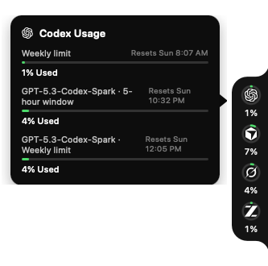
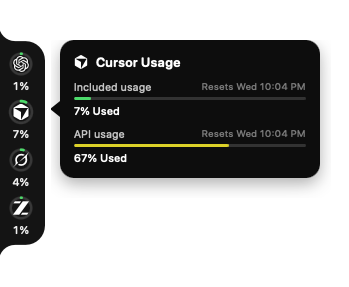
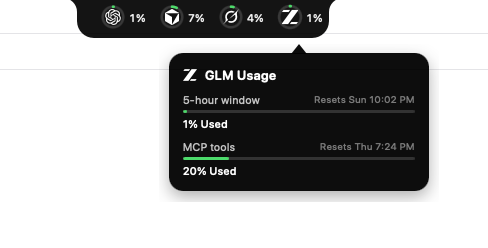
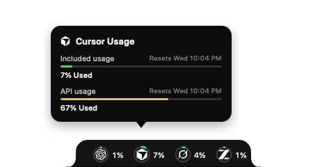

# UsageBar

[English](#english) · [中文](#中文)

A tiny edge bar that shows AI plan usage for **Codex**, **Cursor**, **Grok**, and **GLM**. It reads local login state only, talks to each official API, and never sends your chats through a third-party server.

This is the **cross-platform** edition (Tauri). The original native macOS app is [rayelzz/UsageBar](https://github.com/rayelzz/UsageBar).

macOS 12+ · Windows · Linux · MIT License · [Download latest](https://github.com/rayelzz/UsageBar-tauri/releases/latest)

---

## English

### Contents

- [Demo](#demo)
- [Features](#features)
- [How usage and reset time are read](#how-usage-and-reset-time-are-read)
- [Install](#install)
- [Menu](#menu)
- [FAQ](#faq)
- [Privacy](#privacy)
- [License](#license)

### Demo

The bar stays docked to a screen edge. Hover a ring to see reset times and extra limits.

<p>
  
  &nbsp;
  
</p>

<p>
  
  &nbsp;
  
</p>

| Codex | Cursor |
| --- | --- |
|  |  |

| Grok | GLM |
| --- | --- |
|  |  |

<p>
  
  &nbsp;
  
  &nbsp;
  
</p>

### Features

- Four rings on one compact bar: Codex, Cursor, Grok, GLM
- Hover for included usage, API usage, weekly / 5-hour windows, and reset time
- Drag anywhere; snap to left / right / top / bottom
- Two display styles: **Ring usage** (full rings + percent) or **Transparent icons** (mini rings, still docked to an edge)
- On top / bottom edges, the percent sits to the right of each ring
- Click-through when the mouse is not on the bar
- Status / tray item is the text **UB** (macOS). Right-click the bar or click **UB** for the same menu
- Auto-refresh every 60 seconds (configurable)
- Official brand icons; red when remaining &lt; 20% (used ≥ 80%), yellow when remaining 20%–40% (used 60%–80%), green otherwise

### How usage and reset time are read

UsageBar does **not** estimate anything. It reuses credentials already on this computer and calls each vendor’s official usage endpoint.

| Tool | Local credential | Official API | Ring / tooltip |
| --- | --- | --- | --- |
| **Codex** | `~/.codex/auth.json` | ChatGPT `backend-api/wham/usage` | Weekly limit (and extra windows if present) |
| **Cursor** | Cursor `state.vscdb` session | `cursor.com/api/usage-summary` | Included usage + API usage |
| **Grok** | `~/.grok/auth.json` | `cli-chat-proxy.grok.com/v1/billing` | Weekly allowance + extra windows |
| **GLM** | `GLM_API_KEY` / `~/.zai/config.json` / cc-switch | `api.z.ai` or `open.bigmodel.cn` quota | 5-hour window + weekly + MCP |

Cursor session file:

- macOS: `~/Library/Application Support/Cursor/User/globalStorage/state.vscdb`
- Windows: `%APPDATA%\Cursor\User\globalStorage\state.vscdb`
- Linux: `~/.config/Cursor/User/globalStorage/state.vscdb`

Percent and reset timestamps come from the API (`used_percent`, `autoPercentUsed`, `percentage`, `reset_at`, `billingCycleEnd`, `nextResetTime`, …). Tokens that expire are refreshed locally when possible. A tool you are not signed into simply shows “no data”.

### Install

Needs a working Codex / Cursor / Grok / GLM login **on that same machine**. The installer does not ship anyone’s account.

1. Download the latest build from [Releases](https://github.com/rayelzz/UsageBar-tauri/releases/latest).
   - macOS Apple Silicon (M): `aarch64.dmg`
   - macOS Intel: `x64.dmg`
   - Windows: `x64-setup.exe`
   - Linux: `.AppImage` or `.deb`
2. macOS builds are unsigned (ad-hoc). First launch: right-click → Open, or allow it in **System Settings → Privacy & Security**.
3. Sign in to Codex CLI / Cursor / Grok CLI / GLM as you already do. UsageBar will pick up those sessions.

Build from source:

```bash
npm install
npm run tauri dev      # development
npm run tauri build    # local installer
```

Artifacts:

- macOS: `src-tauri/target/release/bundle/dmg`
- Windows: `src-tauri/target/release/bundle/nsis`
- Linux: `src-tauri/target/release/bundle/appimage` or `deb`

Push a `v*` tag to run GitHub Actions and publish macOS (Apple Silicon + Intel), Windows, and Linux (see `.github/workflows/release.yml`).

### Menu

Menu bar / tray **UB**, or right-click the bar:

- Refresh now; auto-refresh 15s–10min or off
- Lock position / click-through (**Don’t block clicks below**)
- Snap left / right / top / bottom
- Display style: Ring usage / Transparent icons
- Open at login; quit

Preferences are stored at `~/.usagebar/prefs.json`.

### FAQ

**Why does one tool show “no data”?**  
That tool is not signed in on this computer, or UsageBar cannot read its local credential. Sign in with the official app / CLI first, then choose **Refresh now**.

**Cursor says “Cursor login not found” / 未找到 Cursor 登录信息.**  
UsageBar reads `cursorAuth/accessToken` and `cursorAuth/userId` from Cursor’s local `state.vscdb`. Open the **Cursor desktop app** on this machine and sign in. Installing UsageBar on another computer does not copy your Cursor session.

**I sent UsageBar to a friend and they see no Cursor / Codex data.**  
Expected. Credentials stay on each machine. They need their own Cursor / Codex / Grok / GLM login.

**Does UsageBar upload chats or package my tokens?**  
No. It only reads local session files / env keys and calls official usage APIs. Tokens are never bundled into the installer.

**I cannot click windows behind the bar.**  
Turn on **Don’t block clicks below** (on by default). When the pointer is not over the bar, clicks pass through.

**I cannot click the bar or open the menu.**  
If click-through is on, click empty glass around the rings may pass through. Hover a ring, or use the **UB** tray item. You can also turn click-through off, then lock the position.

**macOS: “UsageBar cannot be opened” / unidentified developer.**  
The release is not Apple-notarized. Right-click the app → Open, or allow it under **Privacy & Security**.

**What is the difference from the native [UsageBar](https://github.com/rayelzz/UsageBar)?**  
Same idea and similar look. This repo runs on macOS / Windows / Linux via Tauri. The native app is macOS-only (Swift). This edition does **not** collapse into a four-ring island inside the menu bar; the tray stays the text **UB**, and the bar stays on a screen edge. **Transparent icons** is a smaller docked style, not a menu-bar embed.

**Ring colors?**  
Green: used &lt; 60%. Yellow: 60%–80%. Red: ≥ 80%.

**How do I set a GLM key?**  
Export `GLM_API_KEY` (or `ZAI_API_KEY` / `Z_AI_API_KEY`) in your shell, or use `~/.zai/config.json`, or a GLM / 智谱 / z.ai provider in cc-switch.

**Windows / Linux notes.**  
Windows needs WebView2 (the installer can bootstrap it). The tray usually shows an icon instead of title-only text. Linux needs a working system tray.

### Privacy

- Credentials stay on your machine
- Requests go only to official vendor APIs
- No conversation content is uploaded
- No third-party telemetry

### License

[MIT](LICENSE)

---

## 中文

[English](#english) · [中文](#中文)

贴在屏幕边缘的 AI 用量圆环条。平时占位很小，悬停某个圆环看明细和重置时间。可拖到任意位置，靠近边缘自动吸附。

这是 **跨平台** 版（Tauri）。macOS 原生 Swift 版在 [rayelzz/UsageBar](https://github.com/rayelzz/UsageBar)。

### 目录

- [演示](#演示)
- [功能](#功能)
- [用量和重置时间怎么来的](#用量和重置时间怎么来的)
- [安装](#安装)
- [菜单](#菜单)
- [常见问题](#常见问题)
- [隐私](#隐私)
- [许可证](#许可证)

### 演示

<p>
  
  &nbsp;
  
</p>

<p>
  
  &nbsp;
  
</p>

| Codex | Cursor |
| --- | --- |
|  |  |

| Grok | GLM |
| --- | --- |
|  |  |

<p>
  
  &nbsp;
  
  &nbsp;
  
</p>

### 功能

- 一条紧凑条上同时看 Codex、Cursor、Grok、GLM
- 悬停显示套餐用量、API 用量、周窗口 / 5 小时窗口和重置时间
- 可拖动，自动贴左 / 右 / 上 / 下
- 两种显示样式：**圆环用量**（完整圆环 + 百分比）或 **透明图标**（迷你圆环，仍贴在屏幕边缘）
- 顶部 / 底部贴边时，百分比显示在圆环右侧
- 鼠标不在条上时默认点穿，不挡后面窗口
- 状态栏 / 托盘是文字 **UB**（macOS）。右键圆环条或点 **UB** 打开同一套菜单
- 默认 60 秒刷新，可改
- 官方品牌图标；剩余 &lt; 20%（已用 ≥ 80%）红，剩余 20%–40%（已用 60%–80%）黄，其余绿

### 用量和重置时间怎么来的

应用**不做估算**。它复用本机已有登录态，直接请求各家官方用量接口。

| 工具 | 本机凭证 | 官方接口 | 圆环 / 气泡 |
| --- | --- | --- | --- |
| **Codex** | `~/.codex/auth.json` | ChatGPT `backend-api/wham/usage` | 周额度（及额外窗口） |
| **Cursor** | Cursor `state.vscdb` 会话 | `cursor.com/api/usage-summary` | Included usage + API usage |
| **Grok** | `~/.grok/auth.json` | `cli-chat-proxy.grok.com/v1/billing` | 周额度 + 额外窗口 |
| **GLM** | `GLM_API_KEY` / `~/.zai/config.json` / cc-switch | `api.z.ai` 或智谱 quota | 5 小时窗口 + 周额度 + MCP |

Cursor 会话文件位置：

- macOS：`~/Library/Application Support/Cursor/User/globalStorage/state.vscdb`
- Windows：`%APPDATA%\Cursor\User\globalStorage\state.vscdb`
- Linux：`~/.config/Cursor/User/globalStorage/state.vscdb`

百分比和重置时间都是接口原样返回。过期 token 会尽量在本地刷新。没装或没登录的工具显示暂无数据。

### 安装

对方电脑必须**自己登录** Codex / Cursor / Grok / GLM。安装包不带任何人的账号。

1. 从 [Releases](https://github.com/rayelzz/UsageBar-tauri/releases/latest) 下载对应系统的包。
   - macOS 苹果芯片（M 系列）：`aarch64.dmg`
   - macOS Intel：`x64.dmg`
   - Windows：`x64-setup.exe`
   - Linux：`.AppImage` 或 `.deb`
2. macOS 包是临时签名。第一次打开用右键 → 打开，或在 **系统设置 → 隐私与安全性** 里允许。
3. 照常登录 Codex CLI / Cursor / Grok CLI / GLM，UsageBar 会读这些登录态。

从源码打包：

```bash
npm install
npm run tauri dev      # 开发
npm run tauri build    # 本机安装包
```

产物目录：

- macOS：`src-tauri/target/release/bundle/dmg`
- Windows：`src-tauri/target/release/bundle/nsis`
- Linux：`src-tauri/target/release/bundle/appimage` 或 `deb`

推送 `v*` 标签会走 GitHub Actions，同时出 macOS（苹果芯片 + Intel）、Windows 和 Linux 的包。

### 菜单

菜单栏 / 托盘 **UB**，或右键圆环条：立即刷新、自动刷新、锁定位置、不阻挡下方点击、贴左 / 右 / 上 / 下、显示样式、登录时打开、退出。

偏好存在 `~/.usagebar/prefs.json`。

### 常见问题

**某个工具显示「暂无数据」？**  
这台电脑上还没登录该工具，或读不到本机凭证。先用官方应用 / CLI 登录，再点 **立即刷新**。

**Cursor 提示「未找到 Cursor 登录信息」？**  
UsageBar 从 Cursor 本机 `state.vscdb` 读 `cursorAuth/accessToken` 和 `cursorAuth/userId`。请在**这台电脑**打开 Cursor 桌面端并登录。把 UsageBar 拷给别人，不会带上你的 Cursor 登录态。

**发给朋友后，对方看不到 Cursor / Codex 用量？**  
这是预期行为。凭证只存在各自电脑上，对方需要自己登录。

**会不会上传对话，或把 token 打进安装包？**  
不会。只读本机会话文件 / 环境变量，只请求官方用量接口。安装包里没有账号。

**点不到条后面的窗口？**  
打开 **不阻挡下方点击**（默认开启）。鼠标不在条上时，点击会穿过。

**点不到圆环条 / 打不开菜单？**  
点穿开启时，点圆环周围的透明区域可能点到后面。请悬停圆环，或用托盘 **UB**。也可以先关掉点穿，再锁定位置。

**macOS 提示无法打开 / 未识别的开发者？**  
发布包未做 Apple 公证。请右键应用 → 打开，或到 **隐私与安全性** 允许。

**和原生 [UsageBar](https://github.com/rayelzz/UsageBar) 有什么区别？**  
用途和观感对齐。本仓库用 Tauri，支持 macOS / Windows / Linux；原生版只做 macOS（Swift）。跨平台版**不会**把四个圆环塞进菜单栏：托盘一直是文字 **UB**，用量条留在屏幕边缘。**透明图标**是更小的贴边样式，不是菜单栏嵌入。

**圆环颜色？**  
绿：已用 &lt; 60%。黄：60%–80%。红：≥ 80%。

**GLM 的 Key 放哪？**  
在 shell 里导出 `GLM_API_KEY`（或 `ZAI_API_KEY` / `Z_AI_API_KEY`），或写 `~/.zai/config.json`，或在 cc-switch 里配置 GLM / 智谱 / z.ai。

**Windows / Linux 注意。**  
Windows 需要 WebView2（安装器可引导下载）。托盘通常会显示图标，而不是只有标题文字。Linux 需要可用的系统托盘。

### 隐私

只读本机凭证，只请求官方接口，不上传对话，无第三方统计。

### 许可证

[MIT](LICENSE)
