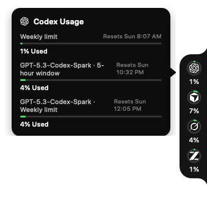
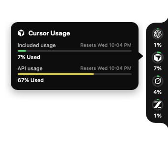
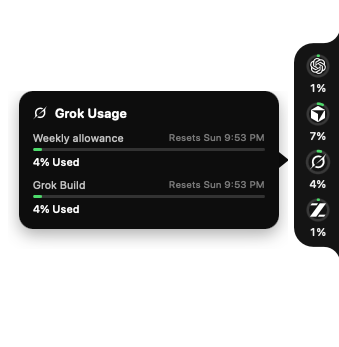
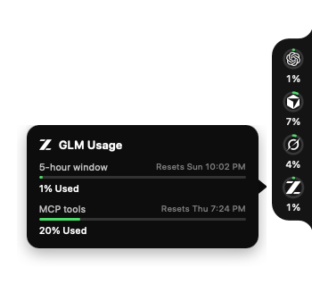
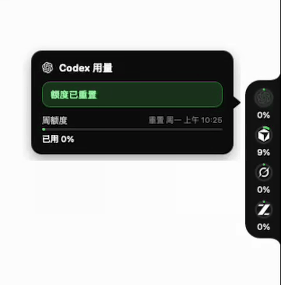
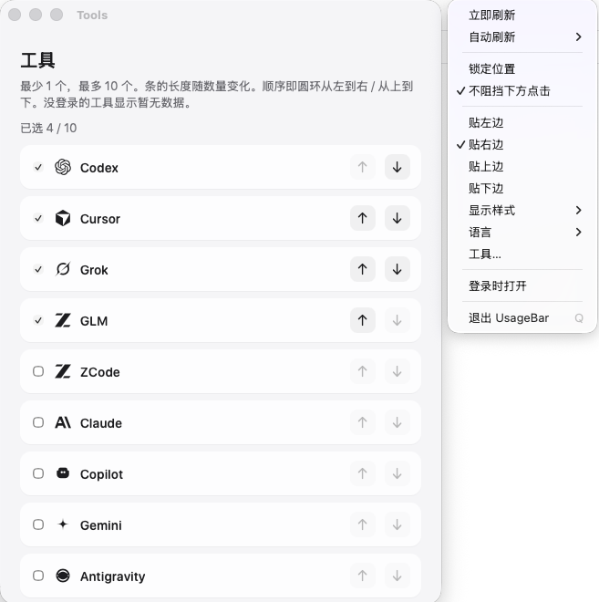
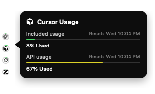

# UsageBar

[English](README.md) · [中文](README_CN.md)

贴在屏幕边缘的 AI 用量圆环条。默认显示 **Codex**、**Cursor**、**Grok**、**GLM**，也可在 **工具…** 里换成 **ZCode**、**Claude**、**Copilot**、**Gemini**、**Antigravity**。平时占位很小，悬停某个圆环看明细和重置时间。可拖到任意位置，靠近边缘自动吸附。只读本机登录态，只请求各家官方接口，不会把对话发到第三方服务器。

macOS 12+ · Windows · Linux · MIT License · [下载最新版](https://github.com/rayelzz/UsageBar-tauri/releases/latest)

### 目录

- [功能](#功能)
- [用量和重置时间怎么来的](#用量和重置时间怎么来的)
- [安装](#安装)
- [菜单](#菜单)
- [常见问题](#常见问题)
- [隐私](#隐私)
- [许可证](#许可证)

| Codex | Cursor |
| --- | --- |
|  |  |

| Grok | GLM |
| --- | --- |
|  |  |

| 额度已重置 |
| --- |
|  |

<p>
  
  &nbsp;
  
</p>

### 功能

- 条的长度随选中数量变化，**最少 1 个、最多 10 个**。默认 Codex、Cursor、Grok、GLM，可在 **工具…** 里勾选并调整顺序
- 悬停显示套餐用量、API 用量、周窗口 / 5 小时窗口和重置时间
- 某个窗口从已用百分比回到 **0%** 时，该槽位图标绿灯闪动并弹出气泡；鼠标悬停气泡出现 **×**，点了才关闭
- 可拖动，自动贴左 / 右 / 上 / 下
- 两种显示样式：**圆环用量**（完整圆环 + 百分比）或 **透明图标**（迷你圆环，仍贴在屏幕边缘）
- 顶部 / 底部贴边时，百分比显示在圆环右侧
- 鼠标不在条上时默认点穿，不挡后面窗口
- 状态栏 / 托盘是文字 **UB**（macOS）。右键圆环条或点 **UB** 打开同一套菜单
- 默认 60 秒刷新，可改
- 官方品牌图标；剩余 &lt; 20%（已用 ≥ 80%）红，剩余 20%–40%（已用 60%–80%）黄，其余绿

### 用量和重置时间怎么来的

应用**不做估算**。它复用本机已有登录态，直接请求各家官方用量接口。

| 工具 | 本机凭证 | 官方接口 | 圆环 / 气泡 |
| --- | --- | --- | --- |
| **Codex** | `~/.codex/auth.json` | ChatGPT `backend-api/wham/usage` | 周额度（及额外窗口） |
| **Cursor** | Cursor `state.vscdb` 会话（旧版 `cursorAuth/userId`，或新版 `glass.lastSignedInAuthId` / JWT `sub`） | `cursor.com/api/usage-summary` | Included usage + API usage |
| **Grok** | `~/.grok/auth.json` | `cli-chat-proxy.grok.com/v1/billing` | 周额度 + 额外窗口 |
| **GLM** | `GLM_API_KEY` / `~/.zai/config.json` / cc-switch | `api.z.ai` 或智谱 quota | 5 小时窗口 + 周额度 + MCP |
| **ZCode** | `~/.zcode/v2/config.json` 里的 Coding Plan Key | 与 GLM 同一套官方配额接口（按 BigModel / Z.ai 选主机） | 5 小时窗口 + 周额度 + MCP |
| **Claude** | macOS 钥匙串 `Claude Code-credentials`，或 `~/.claude/.credentials.json` | Anthropic `api/oauth/usage` | 5 小时窗口 + 周额度（及 Opus） |
| **Copilot** | `~/.config/github-copilot/apps.json` / `hosts.json`，或 `gh` 的 `hosts.yml`，或 `GITHUB_TOKEN` | GitHub `copilot_internal/user` | Premium 请求 + 重置日期 |
| **Gemini** | `~/.gemini/oauth_creds.json` | Cloud Code Assist `retrieveUserQuota` | 各模型剩余比例 + 重置 |
| **Antigravity** | `~/.gemini/antigravity-cli/antigravity-oauth-token` | Cloud Code Assist `fetchAvailableModels` | 最紧一档配额 + 重置 |

Cursor 会话文件位置：

- macOS：`~/Library/Application Support/Cursor/User/globalStorage/state.vscdb`
- Windows：`%APPDATA%\Cursor\User\globalStorage\state.vscdb`
- Linux：`~/.config/Cursor/User/globalStorage/state.vscdb`

百分比和重置时间都是接口原样返回。过期 token 会尽量在本地刷新。没装或没登录的工具显示暂无数据。

### 安装

对方电脑必须**自己登录**要看的那些工具。安装包不带任何人的账号。

1. 从 [Releases](https://github.com/rayelzz/UsageBar-tauri/releases/latest) 下载对应系统的包。
   - macOS 苹果芯片（M 系列）：`aarch64.dmg`
   - macOS Intel：`x64.dmg`
   - Windows：`x64-setup.exe`
   - Linux：`.AppImage` 或 `.deb`
2. macOS 包是临时签名（未做 Apple 公证）。把 `UsageBar.app` 拖进 **应用程序** 后，在终端执行一次（Sequoia / Tahoe 上必须这样做；「右键 → 打开」常常没用）：

   ```bash
   xattr -cr /Applications/UsageBar.app
   open /Applications/UsageBar.app
   ```

   「UsageBar.app 已损坏」是系统隔离标记，不是文件坏了。不要点「移到废纸篓」。
3. 照常登录要用的工具（Codex CLI、Cursor、Grok CLI、GLM、Claude Code、GitHub Copilot、Gemini CLI、Antigravity），UsageBar 会读这些登录态。

从源码打包：

```bash
npm install
npm run tauri dev      # 开发
npm run tauri build    # 本机安装包
```

产物目录：

- macOS：`src-tauri/target/release/bundle/dmg`
- Windows：`src-tauri/target/release/bundle/nsis`
- Linux：`src-tauri/target/release/bundle/appimage` 或 `deb`

推送 `v*` 标签会走 GitHub Actions，同时出 macOS（苹果芯片 + Intel）、Windows 和 Linux 的包。

### 菜单

菜单栏 / 托盘 **UB**，或右键圆环条：立即刷新、自动刷新、锁定位置、不阻挡下方点击、贴左 / 右 / 上 / 下、显示样式、语言（默认 English，可切 中文；厂商和模型名保持英文）、**工具…**（1–10 个，上下排序，条长随数量变化）、登录时打开、退出。

偏好存在 `~/.usagebar/prefs.json`。

### 常见问题

**某个工具显示「暂无数据」？**  
这台电脑上还没登录该工具，或读不到本机凭证。先用官方应用 / CLI 登录，再点 **立即刷新**。

**Cursor 提示「未找到 Cursor 登录信息」？**  
UsageBar 从 Cursor 本机 `state.vscdb` 读 `cursorAuth/accessToken`（JWT 往往有几百个字符，旧版本误把超长 token 丢掉了）。用户 ID 依次尝试 `cursorAuth/userId`、`glass.lastSignedInAuthId`、`adminSettings.cachedAuthId`、access token JWT 的 `sub`。请在**这台电脑**打开 Cursor 桌面端并登录。把 UsageBar 拷给别人，不会带上你的 Cursor 登录态。

**Grok 已登录却显示「暂无数据」？**  
登录态在 `~/.grok/auth.json`。新版 Grok CLI 统一计费不再返回 `creditUsagePercent`；现在会同时读 `/v1/billing` 的月度 / 按需字段，没有百分比时仍显示周窗口。

**发给朋友后，对方看不到 Cursor / Codex 用量？**  
这是预期行为。凭证只存在各自电脑上，对方需要自己登录要显示的那些工具。

**Claude / Copilot / Gemini / Antigravity 显示「暂无数据」？**  
先在这台电脑用对应官方 CLI / 编辑器登录。Claude 读钥匙串或 `~/.claude/.credentials.json`，Copilot 读 `~/.config/github-copilot`，Gemini 读 `~/.gemini/oauth_creds.json`，Antigravity 读 `~/.gemini/antigravity-cli/antigravity-oauth-token`。UsageBar 不会从本地日志估算 token。

**会不会上传对话，或把 token 打进安装包？**  
不会。只读本机会话文件 / 环境变量，只请求官方用量接口。安装包里没有账号。

**点不到条后面的窗口？**  
打开 **不阻挡下方点击**（默认开启）。鼠标不在条上时，点击会穿过。

**点不到圆环条 / 打不开菜单？**  
点穿开启时，点圆环周围的透明区域可能点到后面。请悬停圆环，或用托盘 **UB**。也可以先关掉点穿，再锁定位置。

**macOS 提示「UsageBar.app 已损坏，无法打开」/ 未识别的开发者？**  
文件没有损坏。Chrome / Safari 会给下载打上隔离标记，而发布包未做 Apple 公证。在 Sequoia / Tahoe 上，右键 → 打开和 **隐私与安全性** 通常无效。把应用拷到 `/Applications` 后执行：

```bash
xattr -cr /Applications/UsageBar.app
open /Applications/UsageBar.app
```

**圆环颜色？**  
绿：已用 &lt; 60%。黄：60%–80%。红：≥ 80%。

**GLM 的 Key 放哪？**  
在 shell 里导出 `GLM_API_KEY`（或 `ZAI_API_KEY` / `Z_AI_API_KEY`），或写 `~/.zai/config.json`，或在 cc-switch 里配置 GLM / 智谱 / z.ai。

**ZCode 和 GLM 是同一个圆环吗？**  
不是。ZCode 是智谱的编程 Agent，GLM 是模型 / API Key。菜单 **工具…** 里的 **ZCode** 读 ZCode 已经保存的 Coding Plan Key；**GLM** 读 shell / `.zai` / cc-switch 的 Key。同一套餐会显示同一组百分比，不同账号则分开。UsageBar 不解密 ZCode 的 `enc:v1:` OAuth。

**Windows / Linux 注意。**  
Windows 需要 WebView2（安装器可引导下载）。托盘通常会显示图标，而不是只有标题文字。Linux 需要可用的系统托盘。

### 隐私

只读本机凭证，只请求官方接口，不上传对话，无第三方统计。

### 许可证

[MIT](LICENSE)
